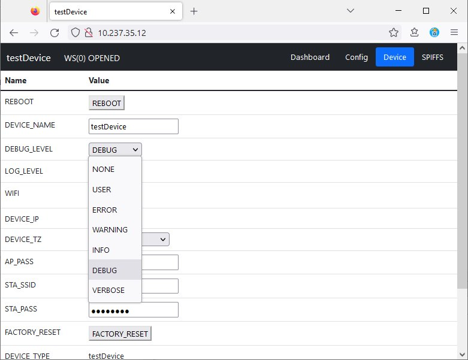

# myIOT - Basics

**[Home](readme.md)** --
**[Getting Started](getting_started.md)** --
**[Wifi](wifi.md)** --
**Basics** --
**[Design](design.md)** --
**[Details](details.md)** --

This page provides an overview of the structure and main concepts of a my_IOT device.

A my_IOT device is, essentially, a collection of **values** that are used to run,
and/or are set by, the device.

It all starts with the **values**.


## A. Values

Values have fixed characteristics, determined by your implementation, that include

- a **value id** that is a unique character string representing the value
- a **value type** (boolean, integer, floating point, enum, string, etc)
- a **storage type** (memory only, persistent preference, published, subscribed to, etc)
- a rendering **style** that indicates how it will be displayed in the Web UI
- a pointer to an static in-memory storage location for the value
- an (optional) pointer to a static method that will be called if the value changes
- for strings, a pointer to a const char buffer for the default value
- for ints, floats, and enums, a **range** indicating default, minimum and maximum allowable values

Taken together, this set of characterstics is called a valDescriptor and implemented in
the following C++ data structure:

```
typedef struct {

    valueIdType id;
    valueType   type;
    valueStore  store;
    valueStyle  style;

    void *val_ptr;      // pointer to actual value in memory
    void *fxn_ptr;      // onChange function to be called (command)

    union {
        const char *default_value;
        struct {
            const int default_value;
            const int int_min;
            const int int_max;
        } int_range;
        struct {
            const float default_value;
            const float float_min;
            const float float_max;
        } float_range;
        struct {
            const uint32_t  default_value;
            enumValue       *allowed;
        } enum_range;
    };

} valDescriptor;
```

The system is driven by **const** tables of these descriptors which you create,
and which live in ESP32 flash memory and so do not take any precious RAM in their
implementation.


### 1. Value Types

The architecture supports a number of different **value types** that programmers
are already familiar with, including *booleans, integers, floating point numbers,
single characters, strings, enumerated types, bitwise types* and *datetimes*.

```
#define VALUE_TYPE_BOOL    'B'        // a boolean (0 or 1)
#define VALUE_TYPE_CHAR    'C'        // a single character
#define VALUE_TYPE_STRING  'S'        // a string
#define VALUE_TYPE_INT     'I'        // a signed 32 bit integer
#define VALUE_TYPE_FLOAT   'F'        // a float
#define VALUE_TYPE_ENUM    'E'        // enumerated integer
#define VALUE_TYPE_BENUM   'J'        // bitwise integer
#define VALUE_TYPE_TIME    'T'        // time stored as 32 bit unsigned integer
#define VALUE_TYPE_COMMAND 'X'        // monadic (commands)
```

There is also the notion of a value being a "command".  A command does not have an actual value
associated with it, but presents itself as a button in the WebUI, or a single word that can be
typed into the serial UI that **does something**, calling a piece of code you write. Two stock,
pre-implemented commands included in this framework are **REBOOT** and **FACTORY_RESET**.

### 2. Storage Types

When you define your values you also set their **storage type** which determines the
visibility and persistence of your values.   For instance, some values can be
merely stored in the ESP32's RAM memory at runtime, and have no persistency across
reboots.  Other values can be stored as *preferences* in EEPROM that persist across
reboots and drive your program's behavior.   A value can be **broadcast** via Websockets
(WS) so that the WebUI can see and use it, and it can be set to be published to and/or
subscribed from an MQTT broker.

```
#define VALUE_STORE_PROG      0x00      // only in ESP32 memory (or not anywhere at all)
#define VALUE_STORE_NVS       0x01      // stored/retrieved from NVS (EEPROM)
#define VALUE_STORE_WS        0x02      // broadcast to / received from WebSockets
#define VALUE_STORE_MQTT_PUB  0x04      // published to (the) MQTT broker
#define VALUE_STORE_MQTT_SUB  0x08      // subscribed to from (the) MQTT broker
#define VALUE_STORE_SERIAL    0x10      // recieved from serial port
```

These defines are also used to keep track of the source of values set from various
places, so one can keep track of who is setting what by looking at the log file and
debugging output.  For this reason, there is an additional VALUE_STORE_SERIAL that
tells us a value was set from the serial port, which is not normally used when
DEFINING a value.

These **storage types** can be combined bitwise, and there are some defines for
common combinations:

```
#define VALUE_STORE_PREF      (VALUE_STORE_NVS | VALUE_STORE_WS)
#define VALUE_STORE_TOPIC     (VALUE_STORE_MQTT_PUB | VALUE_STORE_MQTT_SUB | VALUE_STORE_WS)
#define VALUE_STORE_PUB       (VALUE_STORE_MQTT_PUB | VALUE_STORE_WS)
```

In this notion, a *preference* is something that is stored in NVS
(non-volatile storage == EEPROM), and which is nominally sent to and
received from the WebSockets (WebUI) user interface, but not to (or from) an MQTT
broker.

And he last two defines implement MQTT concepts of a *topic*, which is published and
can be subscribed to, as well as broadcast to the WebUI, and a *publish-only* value
which is broadcast to the WebUI and MQTT, but not settable via MQTT.


### 3. Value Styles

The value **style** determines rendering and behavior characteristics of the value in
the WebUI including things like whether or not it can be modified by the user,
(VALUE_STYLE_READONLY), or, for instance, whether, as a string, if it should be
encrypted and generally hidden from view (VALUE_STYLE_PASSWORD), and so on.

```
#define VALUE_STYLE_NONE        0x0000      // no special styling
#define VALUE_STYLE_READONLY    0x0001      // Value may not be modified except by PROG
#define VALUE_STYLE_REQUIRED    0x0002      // String item may not be blank
#define VALUE_STYLE_PASSWORD    0x0004      // displayed as '********', protected in debugging, etc. Gets "retype" dialog in UI
    // by convention, for hiding during debugging, password elements should be named with "_PASS" in them,
    // and the global define DEBUG_PASSWORDS implemented to ensure they are not, or are
    // displayed in LOGN calls.
#define VALUE_STYLE_TIME_SINCE  0x0008      // UI shows '23 minutes ago' in addition to the time string
#define VALUE_STYLE_VERIFY      0x0010      // UI command buttons will display a confirm dialog
#define VALUE_STYLE_LONG        0x0020      // UI will show a long (rather than default 15ish) String Input Control
#define VALUE_STYLE_OFF_ZERO    0x0040      // Allows 0 below min and displays it as "OFF"
#define VALUE_STYLE_VERBOSE     0x0080      // if DEBUG_VALUE, these values changes will be logged as "verbose" and will not show up in logfiles
#define VALUE_STYLE_RETAIN      0x0100      // MQTT if published, will be "retained"
    // CAREFUL with the use of MQTT retained messages!!
    // They can only be cleared on the rpi with:
    //      sudo service mosquitto stop
    //      sudo rm /var/lib/mosquitto/mosquitto.db
    //      sudo service mosquitto start
```

VALUE_STYLE_VERBOSE is used in the debugging of the value setting code itself,
and generally not intended for use by clients.

VALUE_STYLE_RETAIN is the only style that is specific to MQTT, and is used to
tell the MQTT broker to retain the value persistently, and should be used with care.

As with the Storage types, these style flags are interpreted bitwise, and there
are a couple of combined definitions that I use here and there:

```
#define VALUE_STYLE_HIST_TIME    (VALUE_STYLE_READONLY | VALUE_STYLE_TIME_SINCE)
#define VALUE_STYLE_NO_LOG       (VALUE_STYLE_READONLY | VALUE_STYLE_VERBOSE)
```

### 4. Value Pointer

Each value can have a static pointer to a variable in memory that will be
used to hold the value.

```
void *val_ptr;      // pointer to actual value in memory
```

Generally these values are implemented as **private static** member variables
of the appropriate type in your derived myIOTDevice class, and their address is
cast from the member variable into a void star (a generic 32 bit memory pointer).

Although you can, if you wish, access these member variables directly in memory,
it is generally better to access them through the base myIOTDevice **get** and
**set** methods.


### 5. Function Pointer

Each value can also have a pointer to a static method that will be called anytime
the value changes.  These function pointers are also used to implement "command"
values, by supplying the method that will be called when the command is invoked.

```
void *fxn_ptr;      // onChange function to be called (command)
```

For commands, the method called will be a simple void method:

```
static void someCommand();
```

And for value changes, the method called will receive a const pointer
to the valDescriptor for the value along with (a copy of) the value itself,
where the declared type of the value MUST match the VALUE_TYPE it is
declared with:

```
static void onBoolChange(const myIOTValue *desc, bool val)
```

In this example, the method will receive a boolean value (1 or 0).


### 6. Default Values and Ranges

The valDescriptor data structure is designed so that it can entirely be
populated via inline static initialization.  Later we will see that when
we delve into the table used in the testDevice, but because of this static
initialization approach, it leads to the somewhat complicated
**union** within the valDescriptor for the default values, minimums,
and maximums for the various types of values.

In the simplest case, for Characters and Strings, the **default_value** pointer
is set to point to a const char *string which constitutes the default value for the
character or string.

Integers and Floating point numbers have their own substructures within this union
that specify the default, minimum, and maximum numbers the value is allowed to take on.

Enumerated and bitwise values have a uint32_t for their defaults, and have a
pointer to a **null terminated array of strings** that will be used as synonyms
for the individual values.  The number of strings in the array implicitly defines
the range of the enumerated or bitwise value.

For instance, the system itself defines the allowed "log" and "debug" levels to
be from zero to five (0..5) via the following array of strings:

```
static enumValue logAllowed[] = {
    "NONE",
    "USER",
    "ERROR",
    "WARNING",
    "INFO",
    "DEBUG",
    0};
```

In the Serial UI, you can set the LOG_LEVEL by either using a number, or one of these
synonyms:

```
LOG_LEVEL=2

or

LOG_LEVEL=ERROR
```

In the WebUI, enums will present the user with a drop down box that lets them select
one of the values:




## B. Breaking down the testDevice.ino program

So, armed with all of that, let's break down every line of the **testDevice.ino** program
to see how a simple my_IOT device is implemented.

### 1. Header Includes and ID definitions

The file starts by including **myIOTDevice.h** and **myIOTLog.h**, declaring
two const char * strings for the TEST_DEVICE type (and initial name) and
the TEST_DEVICE version.

It then defines PIN_ONBOARD_LED as 2 for the pin that will be toggled to
turn the onboard LED on and off.

Finally this snippet defines the ID's for the two values that will make up
the testDevice ... the const char * ID's for the ONBOARD_LED and DEMO_MODE values:

```
//-----------------------------------
// testDevice.ino
//-----------------------------------

#include <myIOTDevice.h>
#include <myIOTLog.h>

//------------------------
// testDevice definition
//------------------------

#define TEST_DEVICE             "testDevice"
#define TEST_DEVICE_VERSION     "t1.0"

#define PIN_ONBOARD_LED     2

#define ID_ONBOARD_LED      "ONBOARD_LED"
#define ID_DEMO_MODE        "DEMO_MODE"
```

### 2. What shows up in the Dashboard and Config Tabs

The next small section of code defines two null terminated
arrays of strings (value id's) that will be used to tell the system what will
show up in the Dashboard, and Config tabs of the webUI, respectively.


```
// what shows up on the "dashboard" UI tab

static valueIdType dash_items[] = {
    ID_ONBOARD_LED,
    ID_DEMO_MODE,
    ID_REBOOT,
    0
};

// what shows up on the "config" UI tab

static valueIdType config_items[] = {
    ID_DEMO_MODE,
    0
};
```


### 3. The testDevice class declaration

Next comes the declaration for the testDevice class which is
publicly derived from the base myIOTDevice class.

We declare, but do not implement a constructor, and declare
and implement a default destructor.

Then we override the base classes **setup()** method to call
pinMode for the ONBOARD_LED setting it to OUTPUT.  The derived
class calls the base class myIOTDevice::setup(); method at the
end.

We note that we are using the base class **loop()** method without
any changes, before we go to the *private* section of the class
declaration.


```
class testDevice : public myIOTDevice
{
public:

    testDevice();
    ~testDevice() {}

    virtual void setup() override
    {
        LOGD("testDevice::setup(%s)",getVersion());
        pinMode(PIN_ONBOARD_LED,OUTPUT);
        myIOTDevice::setup();
    }

    // using baseClass loop() method

private:

    static const valDescriptor m_test_values[];

    static bool _ONBOARD_LED;
    static bool _DEMO_MODE;

    static void onLed(const myIOTValue *desc, bool val)
    {
        String id = desc->getId();
        LOGD("onLed(%s,%d)",id.c_str(),val);
        digitalWrite(PIN_ONBOARD_LED,val);
    }

};
```


Within the *private* section of the class we declare a static table
of valDescriptors for the device, and two static boolean members to
hold the values of ONBOARD_LED and DEMO_MODE.

Finally we provide an inline implementation of a valueChange method
that will be called when the value for the ONBOARD_LED changes. When
that happens we will use LOGD (log "debug") to log that fact to the serial port
and call digitalWrite() to effect the change in the actual pin/LED.


### 4. the testDevice valDescriptor table

Now we get into the meat of the implementation.  This table defines what
values will exist on the device (over and above those from the base myIOTDevice).

Note that this table is completely **const** and resides entirely in
ESP32 flash memory, and does not take up any precious RAM!

We start by providing an overriding defition for the initial device name.
This definition, because it has the same ID as a base class member, will
override the definiton there, and thus end up as the value used within the base
class.  As in the base class, with VALUE_STYLE_REQUIRED we force the user to
provide a value for this string.  It cannot be blank.

We then define two values, one that is not saved persistently (VALUE_STORE_TOPIC)
and one that is (VALUE_STORE_PREF), for the ONBOARD_LED and the DEMO_MODE booleans, respectively.
Neither of them has any special display characteristics, and both have pointers
to the the appropriate static member variables where they live in memory.
In addition, in the case of ONBOARD_LED, there is also a pointer to the private static onLed()
method that will be called when the ONBOARD_LED value changes.

```
// value descriptors for testDevice

const valDescriptor testDevice::m_test_values[] =
{
    { ID_DEVICE_NAME,      VALUE_TYPE_STRING,   VALUE_STORE_PREF,     VALUE_STYLE_REQUIRED,   NULL,   NULL,   TEST_DEVICE },
        // override base class element
    { ID_ONBOARD_LED,      VALUE_TYPE_BOOL,     VALUE_STORE_TOPIC,    VALUE_STYLE_NONE,       (void *) &_ONBOARD_LED,    (void *) onLed, },
    { ID_DEMO_MODE,        VALUE_TYPE_BOOL,     VALUE_STORE_PREF,     VALUE_STYLE_NONE,       (void *) &_DEMO_MODE,       NULL,          },
};

#define NUM_DEVICE_VALUES (sizeof(m_test_values)/sizeof(valDescriptor))
```

Finally we have a define for the number of values in the table, NUM_DEVICE_VALUES,
as being the size of the whole table divided by the size of a single valDescriptor.

This table, defining the values that a device has, along with the ability to place
them on one of two UI webpages, along with storage and styling charactistics, default
values and limits, is the essence of this system.  You define a device in terms of
a number of values, then implement it to use and/or change those values in your code.


### 5. testDevice constructor and static member definitions

This little section of code implements the testDevice constructor which
passes the m_test_values array and NUM_DEVICE_VALUES to the base class via
the call to **addValues()**, and tells the base class about what goes on the
Dashboard and Config tabs by passing our arrays, defined above, in via
the call to **setTabLayout()**.

```
// not inline cuz ctor must know descriptors, which must know members

testDevice::testDevice()
{
    addValues(m_test_values,NUM_DEVICE_VALUES);
    setTabLayouts(dash_items,config_items);
}

// static member data

bool testDevice::_ONBOARD_LED;
bool testDevice::_DEMO_MODE;
```

We also define the two private static class booleans, _ONBOARD_LED and _DEMO_MODE, here.


### 6. INO setup() method

In the next section of code we declare a pointer to one of our testDevices,
and implement the main (testDevice) INO setup() method.

Essentially this simple testDevice setup() method does the following:

- start the **serial port** at 115200 baud and wait a second
- call **setDeviceType()** and **setDeviceVersion()** to tell the base class about ourselves
- use **LOGU()** ... "user" level logging ... to inform about starting up
- instantiate our **testDevice** and call it's **setup()** method
- call **LOGU()** again to inform that everything went ok

Note that we *could have* called pinMode() here, rather than in our testDevice class's
derived setup() method, but this structure better encapsulates the separation between
the device class and the INO program.

```
//--------------------------------
// main
//--------------------------------

testDevice *test_device;


void setup()
{
    Serial.begin(115200);
    delay(1000);

    testDevice::setDeviceType(TEST_DEVICE);
    testDevice::setDeviceVersion(TEST_DEVICE_VERSION);

    LOGU("");
    LOGU("");
    LOGU("testDevice.ino setup() started on core(%d)",xPortGetCoreID());

    test_device = new testDevice();
    test_device->setup();

    LOGU("testDevice.ino setup() finished");
}
```


### 7. INO loop() method

The last part of testDevice.ino contains the loop() method.

I confess that this could have been better encapsulated by implementing it
within a testDevice derived loop() method, but by placing it here
it demonstrates using the myIOTDevice get() and set() methods to access
and modify device values without ever having direct access to the member
variables for them.

We start with a call the testDevice's loop() method.  The INO file **must**
call the device's loop() method.

Then we get the state of the DEMO_MODE value, and if it is true we use
a millis() timer to toggle the state of the ONBOARD_LED every two seconds.

When **test_device->setBool(ID_ONBOARD_LED)** is called, it in turn will
trigger a call to the **testDevice::onLed()** method which will actually
turn the LED on and off.


```
void loop()
{
    test_device->loop();

    if (test_device->getBool(ID_DEMO_MODE))
    {
        uint32_t now = millis();
        static uint32_t toggle_led = 0;
        if (now > toggle_led + 2000)
        {
            toggle_led = now;
            bool led_state = test_device->getBool(ID_ONBOARD_LED);
            test_device->setBool(ID_ONBOARD_LED,!led_state);
        }
    }
}
```

### 8. Quick summary of testDevice.ino

Obviously this **testDevice.ino** is extremely simple.

In a few lines of code we have implemented a parameter driven device that
can perform different behaviors, based on those parameters, and which can
be accessed and controlled via a Serial port, or over Wifi with a fairly
useful WebUI.

If WITH_TELNET=1 is defined, it can also be accessed serially via Telnet
with a client like *Putty* or any other generic Telnet client.

If WITH_MQTT=1 was defined while building this device, it could now easily
be integrated into an existing IOT framework like Home Assistant or NodeRed/Mosquito,
and even controlled from your Alexa or Siri voice interface.


Next:  **[Details](details.md)**
