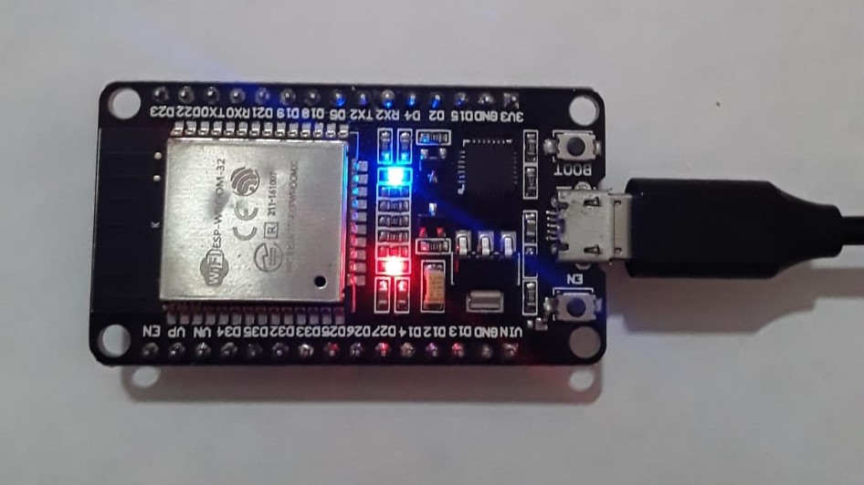
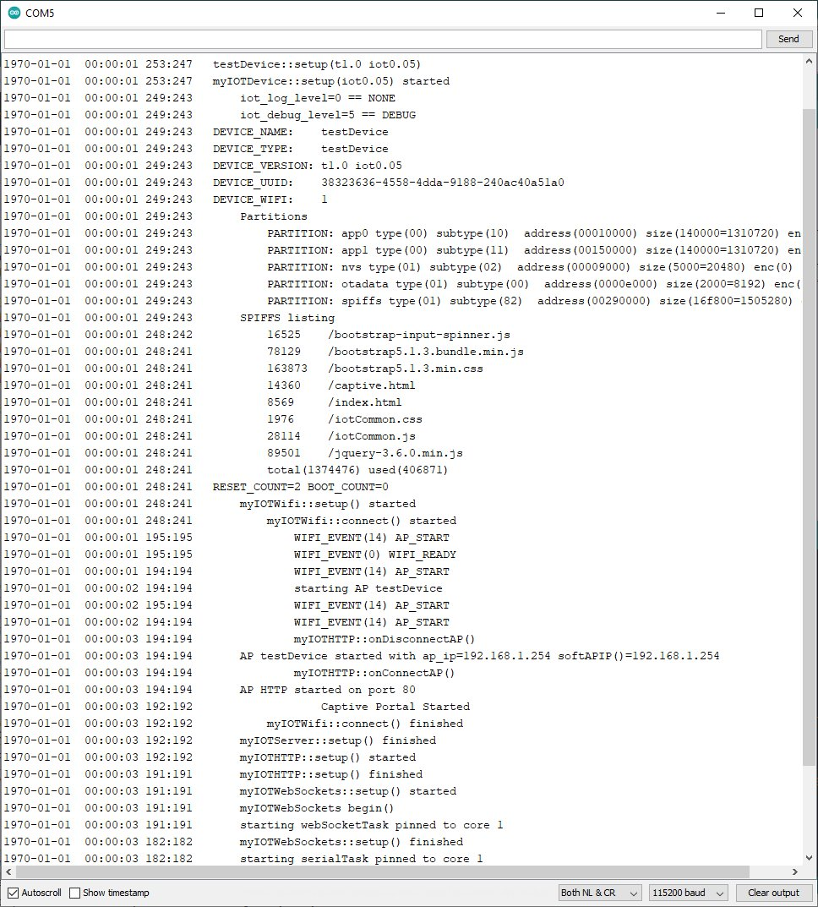
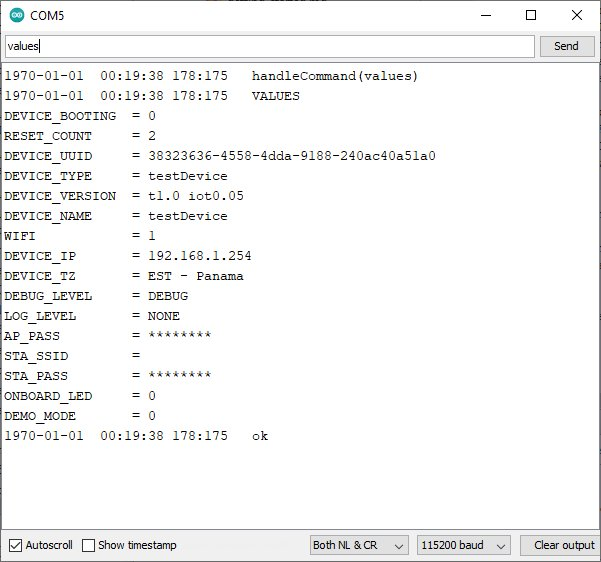

# myIOT - Getting Started

**[Home](readme.md)** --
**Getting Started** --
**[Wifi](wifi.md)** --
**[Basics](basics.md)** --
**[How To](how_to.md)** --
**[Design](design.md)** --
**[Details](details.md)**

This page describes how to get started with myIOT, installing the
library and dependencies, building the testDevice example program,
and running it for the first time.

## A. Installation

### 1. Prepare the Arduino IDE

- install the [**Arduino IDE**](https://www.arduino.cc/en/software)
- add the [**ESP32 board**](https://docs.espressif.com/projects/arduino-esp32/en/latest/installing.html)
to the Arduino IDE using the *Boards Manager*
- add the [**Arduino ESP32 filesystem uploader**](https://github.com/me-no-dev/arduino-esp32fs-plugin)
to your Arduino Sketch "tools" folder

### 2. Get the Source Code

Place a copy of this entire repository into your Arduino-libraries folder.

That can be done using **Git**, or by downloading this repository as a **ZIP file** and placing the
contents of the zip file into your Arduino-libraries folder.  In either case you should end up
with a folder called **myIOT** within your Arduino-libraries folder.


#### High Level Defines

The installation of the myIOT library depends a bit upon what you intend to do with it.

There are compile flags in the file **myIOTTypes.h** that can be set to 1 (one) or 0 (zero) to include
or exclude various pieces of functionality from the library.   *You may want to modify **myIOTTypes.h**
depending on your usage.*   The defaults are appropriate for building the included example **testDevice.ino**
sketch.

- **WITH_WS** default(1) - includes WebSockets, which is **required** for the myIOT web user interface
- **WITH_NTP** default(1) - includes NTP (Network Time Protocol) to set the ESP32 clock when connected as a Wifi Station
- **WITH_MQTT** default(0) - includes MQTT publication/subscription capabilities
- **WITH_TELNET** default(0) - includes a Telnet Serial Client
- **WITH_SD** default(0) - includes SD card and Logging to it
- **DEFAULT_DEVICE_WIFI** default(1) - determines whether or not myIOT Wifi is turned on, or off, by default

It is useful to present these defines here so that you can see how the basic Arduino Library dependencies work
for your initial installation.

### 3. Install additional Arduino Libraries

Depending on the settings of the defines in **myIOTTypes.h**, various additional libraries **MUST BE INSTALLED**
into your Arduino IDE development environment.

- **[ESP32SSDP](https://github.com/phorton1/Arduino-libraries-ESP32SSDP)** - my fork of
	https://github.com/luc-github/ESP32SSDP
- **WebSockets** by Markus Sattler - Version 2.3.6 (if **WITH_WS == 1** default!)
- **ArduinoJson** by Benoit Blanchon - Verson 6.18.5 (if **WITH_WS == 1** default!)
- **PubSubClient** by Nick O'Leary - Version 2.8.0 (if **WITH_MQTT == 1**  by default MQTT is not included)
- **ESP Telnet** by Lennart Hennings - Version 1.2.2 (if **WITH_TELNET == 1** default)


So, in order to build the included **testDevice.ino** example program with the default defines,
you **MUST** install the **Websockets and ArduinoJson** libraries into your Arduino IDE environment.
The simplest way to do that is to use the *Library Manager* in the Arduino IDE.
If you chose to use *Telnet* or *MQTT* you must also install the additional
**ESP Telnet** and/or **PubSubClient** libraries.


## B. Build and Upload the example **testDevice.ino** program

### 1. Onboard LED Pin

The test program is designed for use with a WROOM-32 ESP32 Dev board that has an onboard LED
attached to Pin 2, but *should* be usable with any ESP32 board that is supported by the Arduino IDE.



If you do not have a board with the onboard LED and you want to try this testDevice,
you can create a simple ESP32 circuit on a breadboard with some GPIO pin going to an
LED and a 220 ohm resistor to ground, and modify the source code in testDevice.ino
to set the appropriate pin number in the section of code that looks like this:

```
//------------------------
// testDevice definition
//------------------------

#define TEST_DEVICE             "testDevice"
#define TEST_DEVICE_VERSION     "t1.0"

#define PIN_ONBOARD_LED     2

#define ID_ONBOARD_LED      "ONBOARD_LED"
#define ID_DEMO_MODE        "DEMO_MODE"

```


### 2. Compile and upload from Arduino IDE

- open the **examples/testDevice.ino** sketch in the Arduino IDE
- select the **ESP32 Dev Module** (*or your specific kind of ESP32*) board from the Arduino *Tools-Boards* menu
- select the **Default 4MB with spiffs** (1.2MB App/1.5MB SPIFFS) from the *Tools-Partition Scheme* menu
- select the correct **COM Port** for the ESP32
- build and upload the firmware using the Arduino IDE **Verify/Compile/Upload** commands
- upload the contents of the **examples/data** folder to the ESP32 *SPIFFS* using the **Tools - ESP32 Sketch Data Upload** command

*note: you can choose a different partition scheme, but the partition scheme
you choose must (currently) be capable of storing at least 412kb on the SPIFFS
partition if you want to use the WebUI, and it must include an
OTA partition if you wish to use OTA.*


## C. Run the testDevice from the Arduino IDE Serial Monitor

As soon as you compiled and uploaded the program to the ESP32 it started running.

Open the Arduino Serial Monitor and set it to 115200 and set the line ending dropdown
box to "Both NL & CR".  Recompile and upload the program.

You should see something similar to the following



The default serial debugging logging capabilies are shown in this example.

Each line above starts with a date/time stamp followed by two integers
showing the current, and lowest amount of RAM memory (in K) on the ESP32.
The timestamps start at midnight on January 1 1970, because the device
has not yet connected to the internet and so has not gotten the correct
actual time from NTP (Network Time Protocol).

As for available memory, the device started, in testDevice::setup(),
with about 250K of available ram. We can see, for example, that the Wifi
Access Point, which was turned on by default, uses quite a bit of RAM as the
available memory dropped from about 250K down to 195K.

*note: it is fairly important to keep the available ESP32 ram for this,
and other programs, above 80K or so, especially if using Wifi or other
complicated libraries.*

By default, the device boots up with logging to the SD Card turned off
where you see **iot_log_level=0 == NONE** and in the most verbose serial debugging mode,
where you see **iot_debug_level=5 == DEBUG**.

The next sections show some details about the DEVICE, including it's NAME,
TYPE, VERSION, UUID, and whether or not WIFI is turned on to begin.  All
of the ESP32 memory partitions, including the OTA partition SPIFFS file system
are shown for debugging purposes, followed by a listing of the SPIFFS file system
showing the files that are used for the WebUI.

The serial output then shows, starting with **myIOTWifi::setup()**, the ESP32
starting the WiFi and becoming an Access Point (AP) with an ip address of **192.168.1.254**,
then starting the HTTP and Websockets servers, and starting some other tasks, including
the serialTask which monitors the serial port for input.


### 1. See the Device's Values

You can now communicate with the device by typing commands into the Arduino Serial
monitor and pressing the "send" button.

Typing the word "values" and pressing send will cause the device to show you
all of the values it is maintaining.



The **testDevice** itself only owns/defines a few of these values,
including the static DEVICE_NAME, DEVICE_TYPE, DEVICE_VERSION, values
and the working **ONBOARD_LED** and **DEMO_MODE** values.

The rest of the values including the DEVICE_UUID, DEVICE_IP, DEVICE_TZ,
DEBUG_LEVEL, LOG_LEVL, AP_PASS, STA_SSID, and STA_PASS, are owned by
and defined in the base myIOTDevice class.  Note that the passwords
are lightly encrypted in EEPROM and never shown directly to the user
in any UI or log messages.

*note: the default timezone is set to "EST - Panama", used with NTP
(Network Time Protocol) because that's where I am and where I do my development.*

### 2. Turn the LED on and off

By typing the phrase "ONBOARD_LED=1" into the monitor and pressing "send",
the LED on the ESP32 should turn on, and "ONBOARD_LED=0" should turn it off.

By typing the phrase "DEMO_MODE=1" into the monitor and pressing "send",
the LED on the ESP32 should start flashing once per second, and
"DEMO_MODE=0" should stop it.


### 3. Try some other commands (REBOOT and FACTORY_RESET)

The DEMO_MODE value is stored as a preference, so even if you power
the ESP32 down and reboot it, it should boot up and start flashing
if DEMO_MODE was set to one.


Type "reboot" into the serial monitor and press "send".  The ESP32
should reboot.

To return the ESP32 to it's default settings (that you define when you
define the values for the device), type "factory_reset" and press "send".


## Done!

We are now ready to access the device from a browser via Wifi and the
built-in WebUI.


Next: **[Wifi](wifi.md)**
