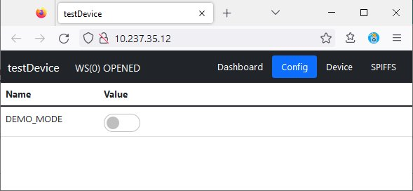

# myIOT - Wifi

**[Home](readme.md)** --
**[Getting Started](getting_started.md)** --
**Wifi** --
**[Basics](basics.md)** --
**[How To](how_to.md)** --
**[Design](design.md)** --
**[Details](details.md)**

This page describes the process of connecting to a myIOT device via Wifi
and the included WebUI.

By default, and in our testDevice program, WiFi is turned on, and the device
started as an "Access Point" (AP) called **testDevice** as soon as the device boots.

If you now attempt to connect to that AP from some machine with a browser,
in my example a Win10 machine, it will automatically pop up a "captive
portal" page that will allow you to connect it to your Wifi network.

FWIW, it was a concious decision that the ONLY thing you can do when the
device is in AP mode is connect to it and tell it how to connect to a
Wifi network.    Once you have specified a station SSID and password
to connect to, the device will automatically connect to that Wifi
network as a STATION, where you can THEN access the
(simple HTTP and Websocket) WebUI
from within your own secure LAN.

The device DOES NOT, itself, present any services or ports to the internet.

If, at any time, the device fails to connect as a STATION it will fall back
to AP mode so that you can, for example, tell it a new password for your
Wifi network in case you change that.

## A. Connecting to the WebUI

### 1. Select the "testDevice" Access Point

The "testDevice" should show up on your machine's list of
possible Wifi connections.   Select it. You can uncheck the
"connect automatically" checkbox.

### 2. Enter the default password and connect to the AP

The default password for a myIOT device is "11111111" (eight ones).
Enter the password and press "Next".
You may be presented with a window asking if you want to allow
network discoverability. It doesn't matter what you answer to
this, and/or the window may just pop up briefly and go away as
the captive portal, below, starts.

### 3. Captive Portal - change AP password

Once you connect with the testDevice AP, it should automatically
open a browser and pop up an "captive portal" page.

The system requires that you change the AP password before allowing
you to do anything else.  Enter and retype a new password, then press
the "Set" button.

### 4. Connect to your Wifi Network

Enter the SSID and password to your wifi network, and press "Join".

The browser will show that it is connecting to your wifi network.

Sometimes this windows never goes away.   That is because once the ESP32 connects
to your Wifi network as a station, it is no longer connected to your machine
as an Access Point.  Sometimes there is a little window of time where the ESP32
can send a "success" message to the browser so that you can see the resultant
IP address assigned to the device within your network, but usually that doesn't
happen.

As long as you DONT GET AN ERROR MESSAGE from this window, then the process worked,
and after 10-30 seconds you may close this window, disconnect from the AP, and re-connect
to your normal Wifi network.

After 30 seconds or so, in any case, the AP will go offline and your machine will
(should) automatically disconnect from it, and if you're like me and have your machine
set to automatically connect to your normal wifi network, then it will likely just
do that.

In any case, for the rest of this process you should be connected, on your
work machine, to the wifi network you told the ESP32 to connect to above.

*note that your Wifi credentials are NOT present in your source code.  They
only exist in (lightly) encrypted ESP32 EEPROM and are used by the ESP32 to
connect to your wifi network only when needed.  They are NOT sent to the WebUI,
nor to any MQTT devices, except as a stand-in string consisting of asterisks.
At no point in this process were you connected to the internet, and the
myIOT_device cannot be accessed except from this
Access Point, or through your (private, safe) home network.*

**myIOT devices do not present anything, any ports or services, to the internet**

### 5. Find the testDevice using SSDP

SSDP is an acronym for Service Search and Discovery Protocol.  This protocol has existed for
20+ years, is well documented and understood.  A myIOT device presents itself as a generic
SSDP device to the local network.   Therefore on a machine that supports SSDP (like a generic
Win10 machine) you should be able to just go to the Network folder in your Windows Explorer program,
right-click in the window and say "refresh" to initiate a new SSDP search, and in a few seconds,
the testDevice should show up in the "Other Devices" section, with an icon.

If you now double click on the device, the below WebUI should load into your default browser.

If you right click on the icon, and go to the properties page, you will be able to see the IP
address of the device.

If you cannot find the device in the Network folder, then you will need to find it's IP
address in some other way.  If you are connected to the ESP32 by a serial cable,
it will be shown in the Serial log (Arduino IDE Serial Monitor) as the machine
connects to your Wifi network.  Otherwise you *may* need to go to your WiFi router's
WebUI and find the IP address that was assigned to the testDevice.

The webUI of the device is gotten by HTTP in a regular browser by just going to it's IP address,
which happens to be 10.237.35.110 in my case.  Yours will probably be more like 192.168.0.12
or something like that.

## B. The WebUI

The WebUI consists of a number of subpages.

- The **Dashboard**
- An application specific device **Config** (configuration) page
- A generic myIOT **Device** page
- A *SPIFFS* file management page (includes OTA)
- and possibly an **SD Card** file management page (if WITH_SD==1 and an SD Card is present)

### 1. The Dashboard

When you define your device, you determine what shows up on the Dashboard and the Config
pages.  In our testDevice we have two swtiches (boolean values) for the state of the
ONBOARD_LED and the setting for DEMO_MODE and a button (a "command" value) to reboot
the ESP32.

### 2. Config Options

In this very simple testDevice, we only have one configuration option, duplicated
from the dashboard page ... the state of the DEMO_MODE boolean, represented as a switch.

### 3. Device Configuration

All myIOT devices include a set of values that include things like
a command button to REBOOT the Esp32, the DEVICE_NAME (which is a user
modifiable "preference" string), the DEBUG_LEVEL and LOG_LEVELS currently
in play, a switch to turn WIFI on or off, and a readonly string showing you
the DEVICE_IP address.

DEVICE_TZ is an enumerated list of a small set of timezones for use with NTP.

Then you have the AP_PASS, STA_SSID, and STA_PASS user editable string values
(where the passwords are hidden and lightly encrypted in EEPROM), a button
for a FACTORY_RESET (which will erase any settings, including passwords, etc)
and return the ESP32 to a known initial state, that you, as a developer define
when you implement your device.

Finally, there is a DEVICE_TYPE, DEVICE_VERSION, DEVICE_UUID (which is terminated
with the complete MAC address of the ESP32), and a working value used in coordinating
the WebUI, DEVICE_BOOTING, which is set to one when a reboot command is issued, and
set to zero upon a successful startup.

### 4. SPIFFS page (including OTA)

On this page you can see, upload, and delete files from the SPIFFS file
system.  The current listing includes the minimum set of files necessary
to run the WebUI.

The WebUI includes the following pieces of open source javascript

- jquery-3.6.0.min.js
	https://jquery.com/download/
- bootstrap5.1.3.bundle.min.js
- bootstrap5.1.3.min.css
	https://getbootstrap.com/docs/5.1/getting-started/download/
- bootstrap-input-spinner.js Version 3.1.7 by Stefen Haack(modified)
	https://github.com/shaack/bootstrap-input-spinner

This page also has the **OTA** button, which when pressed, will
allow you to upload a binary code image to run on the ESP32.

The correct binary image file (**testDevice.ino.bin**) will be found
in your Arduino build directory.  *note: it is really important that
you only upload the correct binary file to your ESP32!!  Anything
else may crash it and require physical access, and a serial cable,
to repair!!*

It is beyond the scope of this document to describe how the
Arduino build system works, or where you will find binary image
files, but such info is fairly easily available via a quick
search on the internet.

### 5. SD Card Page

If the system is compiled with WITH_SD=1 defined, AND a SDCard
reader is correctly hooked up to the ESP32, AND a valid SDCard
is in it, then an additional page showing a listing of the SD
card, and allowing you to upload or delete OUTER LEVEL FILES
only, will appear.

The following window is from a subsequent project, the
[bilgeAlarm](https://github.com/phorton1/Arduino-bilgeAlarm) that I created using this framework.

In THAT project I take advantage of the built in myIOT logging
capabilities to keep a logfile on the SD.  That project also uses
a small data file, run_history.dat, stored on the SD Card.

## C. Done!

Now that you have seen the basic WebUI and have a rough idea of
what a myIOT device is, and how it works, we can move onto the
basic design of the system, and explore the testDevice.ino
implementation in more detail.

Next: **[Basics](basics.md)**
